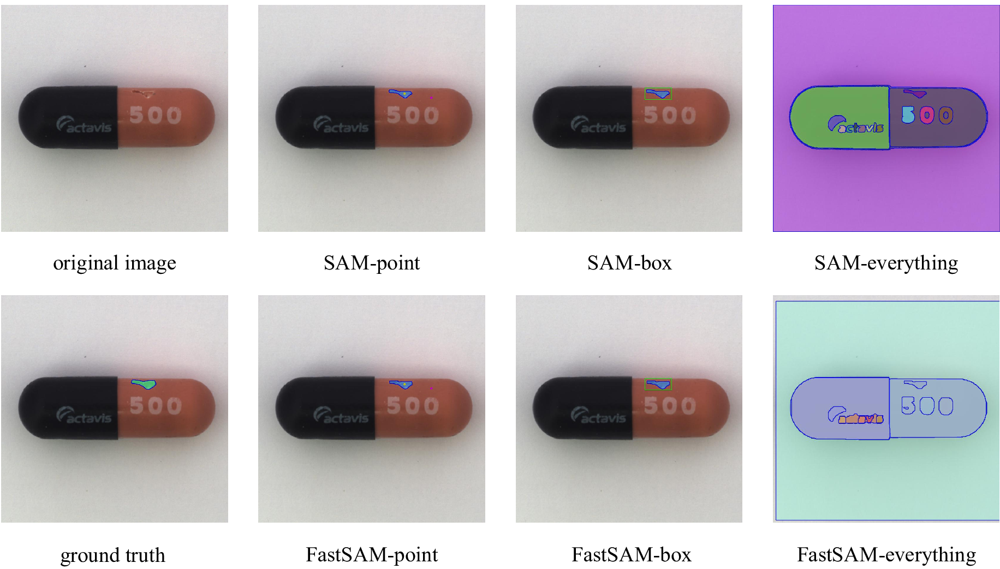
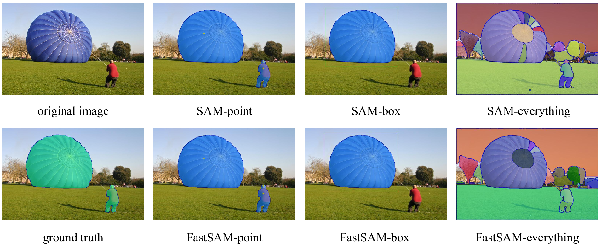
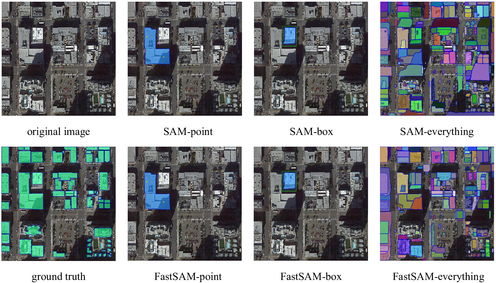

# Fast Segment Anything

[[`📕Paper`](https://arxiv.org/pdf/2306.12156.pdf)] [[`🤗HuggingFace Demo`](https://huggingface.co/spaces/An-619/FastSAM)] [[`Colab demo`](https://colab.research.google.com/drive/1oX14f6IneGGw612WgVlAiy91UHwFAvr9?usp=sharing)] [[`Model Zoo`](#model-checkpoints)] [[`BibTeX`](#citing-fastsam)] [[`Replicate demo & API`](https://replicate.com/cjwbw/fastsam)]


The **Fast Segment Anything Model(FastSAM)** is a CNN Segment Anything Model trained by only 2% of the SA-1B dataset published by SAM authors. The FastSAM achieve a comparable performance with
the SAM method at **50× higher run-time speed**.


## Installation

Clone the repository locally:

```shell
git clone https://github.com/CASIA-IVA-Lab/FastSAM.git
```

Create the conda env. The code requires `python>=3.7`, as well as `pytorch>=1.7` and `torchvision>=0.8`. Please follow the instructions [here](https://pytorch.org/get-started/locally/) to install both PyTorch and TorchVision dependencies. Installing both PyTorch and TorchVision with CUDA support is strongly recommended.

```shell
conda create -n FastSAM python=3.9
conda activate FastSAM
```

Install the packages:

```shell
cd FastSAM
pip install -r requirements.txt
```

Install CLIP:

```shell
pip install git+https://github.com/openai/CLIP.git
```

## <a name="GettingStarted"></a> Getting Started

First download a [model checkpoint](#model-checkpoints).

Then, you can run the scripts to try the everything mode and three prompt modes.

```shell
# Everything mode
python Inference.py --model_path ./weights/FastSAM.pt --img_path ./images/dogs.jpg
```

```shell
# Text prompt
python Inference.py --model_path ./weights/FastSAM.pt --img_path ./images/dogs.jpg  --text_prompt "the yellow dog"
```

```shell
# Box prompt (xywh)
python Inference.py --model_path ./weights/FastSAM.pt --img_path ./images/dogs.jpg --box_prompt "[570,200,230,400]"
```

```shell
# Points prompt
python Inference.py --model_path ./weights/FastSAM.pt --img_path ./images/dogs.jpg  --point_prompt "[[520,360],[620,300]]" --point_label "[1,0]"
```

You are also welcomed to try our Colab demo: [FastSAM_example.ipynb](https://colab.research.google.com/drive/1oX14f6IneGGw612WgVlAiy91UHwFAvr9?usp=sharing).

## Different Inference Options

We provide various options for different purposes, details are in [MORE_USAGES.md](MORE_USAGES.md).

## Web demo

In the [web demo](https://huggingface.co/spaces/An-619/FastSAM), you can upload your own image, select input size from 512~1024, and choose whether to visualize in high quality. High quality visualization additionally shows more easily observable split edges. The web demo only supports Everything Mode now, other modes will try to support in the future.


## <a name="Models"></a>Model Checkpoints

Two model versions of the model are available with different sizes. Click the links below to download the checkpoint for the corresponding model type.

- **`default` or `FastSAM`: [YOLOv8x based Segment Anything Model.](https://drive.google.com/file/d/1m1sjY4ihXBU1fZXdQ-Xdj-mDltW-2Rqv/view?usp=sharing)**
- `FastSAM-s`: [YOLOv8s based Segment Anything Model.](https://drive.google.com/file/d/10XmSj6mmpmRb8NhXbtiuO9cTTBwR_9SV/view?usp=sharing)

## Results

All result were tested on a single NVIDIA GeForce RTX 3090.

### 1. Inference time

Running Speed under Different Point Prompt Numbers(ms).
| method | params | 1 | 10 | 100 | E(16x16) | E(32x32\*) | E(64x64) |
|:------------------:|:--------:|:-----:|:-----:|:-----:|:----------:|:-----------:|:----------:|
| SAM-H | 0.6G | 446 | 464 | 627 | 852 | 2099 | 6972 |
| SAM-B | 136M | 110 | 125 | 230 | 432 | 1383 | 5417 |
| FastSAM | 68M | 40 |40 | 40 | 40 | 40 | 40 |

### 2. Memory usage

|  Dataset  | Method  | GPU Memory (MB) |
| :-------: | :-----: | :-------------: |
| COCO 2017 | FastSAM |      2608       |
| COCO 2017 |  SAM-H  |      7060       |
| COCO 2017 |  SAM-B  |      4670       |

### 3. Zero-shot Transfer Experiments

#### Edge Detection

Test on the BSDB500 dataset.
|method | year| ODS | OIS | AP | R50 |
|:----------:|:-------:|:--------:|:--------:|:------:|:-----:|
| HED | 2015| .788 | .808 | .840 | .923 |
| SAM | 2023| .768 | .786 | .794 | .928 |
| FastSAM | 2023| .750 | .790 | .793 | .903 |

#### Object Proposals

##### COCO

|  method   | AR10 | AR100 | AR1000 | AUC  |
| :-------: | :--: | :---: | :-----: | :--: |
| SAM-H E64 | 15.5 | 45.6  |   67.7 | 32.1 |
| SAM-H E32 | 18.5 | 49.5  |   62.5 | 33.7 |
| SAM-B E32 | 11.4 | 39.6  |   59.1 | 27.3 |
|  FastSAM  | 15.7 | 47.3  |   63.7 | 32.2 |

##### LVIS

bbox AR@1000
| method | all | small | med. | large |
|:---------------:|:-----:|:------:|:-----:|:------:|
| ViTDet-H | 65.0 | 53.2 | 83.3 | 91.2 |
zero-shot transfer methods
| SAM-H E64 | 52.1 | 36.6 | 75.1 | 88.2 |
| SAM-H E32 | 50.3 | 33.1 | 76.2 | 89.8 |
| SAM-B E32 | 45.0 | 29.3 | 68.7 | 80.6 |
| FastSAM | 57.1 | 44.3 | 77.1 | 85.3 |

#### Instance Segmentation On COCO 2017

|  method  |  AP  | APS  | APM  | APL  |
| :------: | :--: | :--: | :--: | :--: |
| ViTDet-H | .510 | .320 | .543 | .689 |
|   SAM    | .465 | .308 | .510 | .617 |
| FastSAM  | .379 | .239 | .434 | .500 |

### 4. Performance Visulization

Several segmentation results:

#### Natural Images


#### Text to Mask


### 5.Downstream tasks

The results of several downstream tasks to show the effectiveness.

#### Anomaly Detection



#### Salient Object Detection



#### Building Extracting



## License

The model is licensed under the [Apache 2.0 license](LICENSE).

## Acknowledgement

- [Segment Anything](https://segment-anything.com/) provides the SA-1B dataset and the base codes.
- [YOLOv8](https://github.com/ultralytics/ultralytics) provides codes and pre-trained models.
- [YOLACT](https://arxiv.org/abs/2112.10003) provides powerful instance segmentation method.
- [Grounded-Segment-Anything](https://huggingface.co/spaces/yizhangliu/Grounded-Segment-Anything) provides a useful web demo template.

## Contributors

Our project wouldn't be possible without the contributions of these amazing people! Thank you all for making this project better.

<a href="https://github.com/CASIA-IVA-Lab/FastSAM/graphs/contributors">
  
</a>


## Citing FastSAM

If you find this project useful for your research, please consider citing the following BibTeX entry.

```
@misc{zhao2023fast,
      title={Fast Segment Anything},
      author={Xu Zhao and Wenchao Ding and Yongqi An and Yinglong Du and Tao Yu and Min Li and Ming Tang and Jinqiao Wang},
      year={2023},
      eprint={2306.12156},
      archivePrefix={arXiv},
      primaryClass={cs.CV}
}
```

[](https://star-history.com/#CASIA-IVA-Lab/FastSAM&Date)
